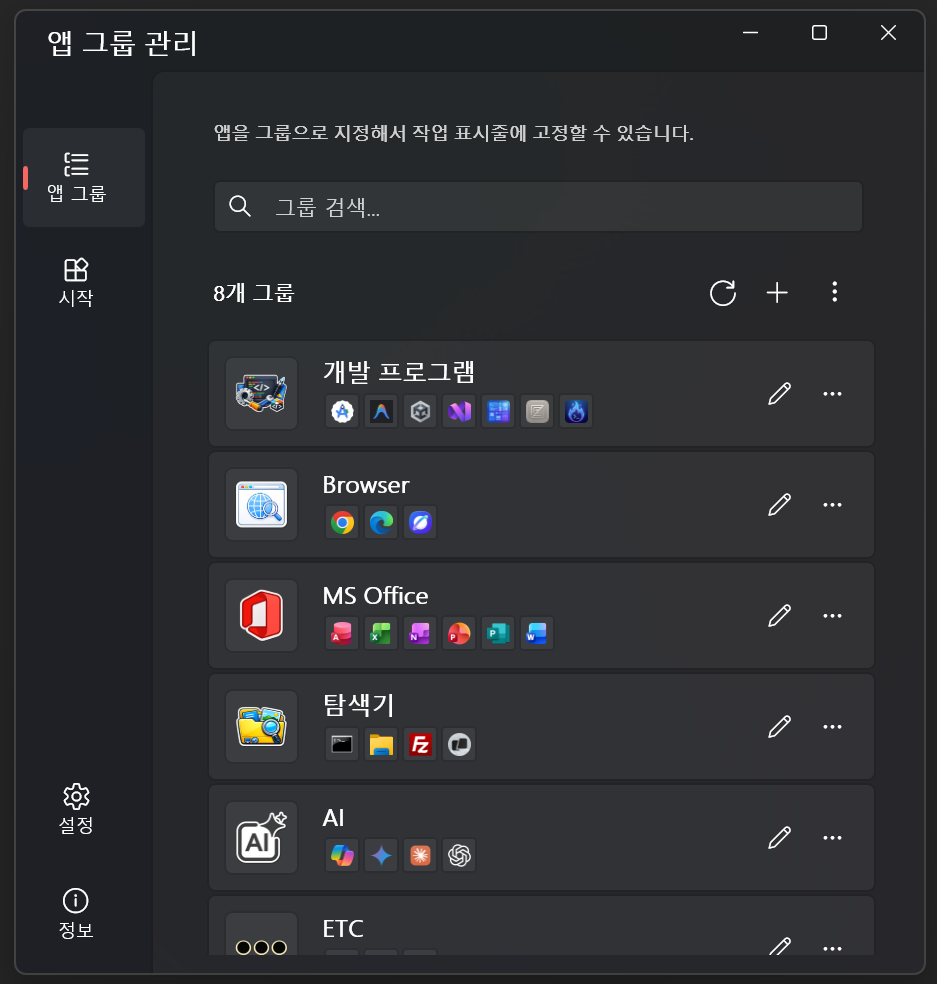
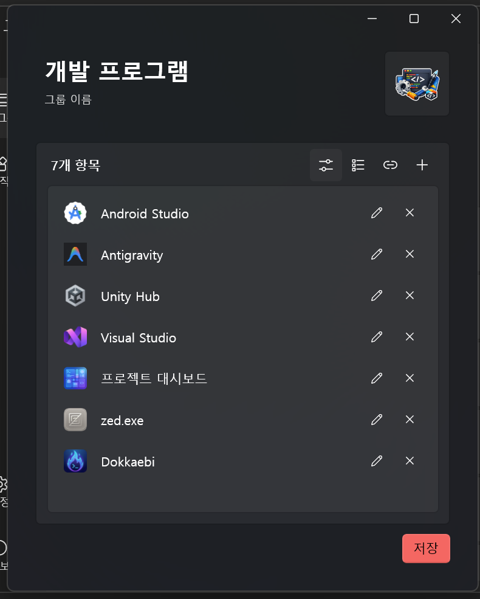
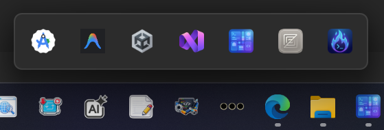
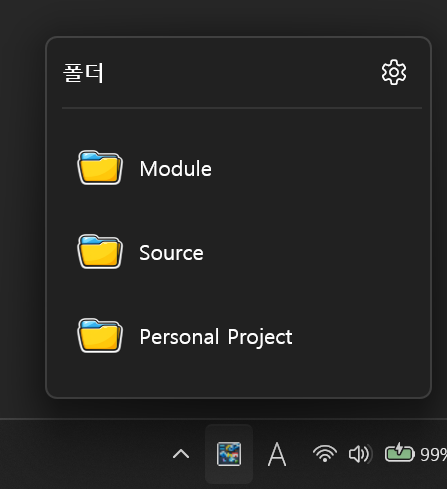
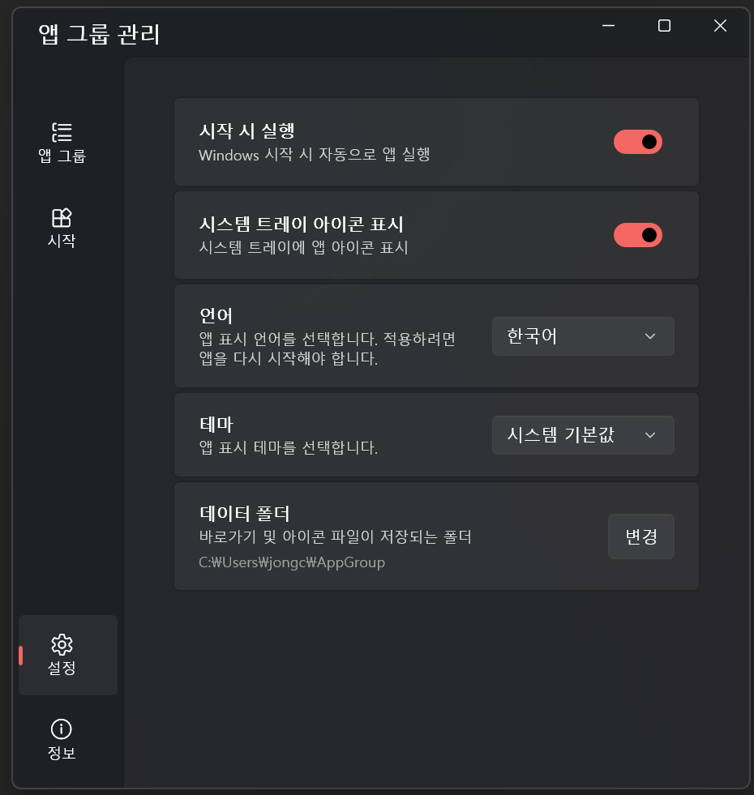

<p align="center">
  
</p>

<h1 align="center">AppGroup</h1>

<p align="center">
Windows 작업 표시줄에서 앱·폴더·웹사이트를 그룹으로 묶어 한 번의 클릭으로 실행할 수 있는 데스크톱 애플리케이션입니다.<br/>
WinUI 3 · .NET 10 · MVVM(CommunityToolkit.Mvvm) · WinUIEx · MSIX 기반으로 만들어졌습니다.
</p>

## 주요 기능

- 작업 표시줄 그룹 관리 — 추가 / 편집 / 삭제 / 복제 / 드래그 순서 변경
- 한 그룹에 앱(.exe, .lnk) · 폴더 · 웹 URL을 혼합 등록 가능
- 작업 표시줄 아이콘 클릭 시 그룹 팝업 윈도우로 빠른 실행
- 시작 메뉴 폴더 등록으로 시스템 트레이에서 자주 쓰는 폴더에 즉시 접근
- 하위 폴더 계층 탐색 (깊이 1~5 단계 설정)
- 숨김 파일/폴더 표시 토글
- 설치된 앱 목록(UWP 포함)에서 손쉽게 등록
- 자동 아이콘 추출 (exe / lnk / UWP / 폴더 / 웹)
- 다국어 UI: English / 한국어 / 日本語 / 简体中文 / 繁體中文 (시스템 기본 자동 선택 가능)
- 테마 변경: 시스템 기본 / 다크 / 라이트 (즉시 적용)
- 백업 내보내기 / 가져오기 (.agz 단일 파일)
- 사용자 지정 데이터 폴더 경로 지원
- 시스템 트레이 상주 (좌클릭 동작 사용자 지정)
- Windows 시작 시 자동 실행
- Microsoft Store 업데이트 확인

## 시스템 요구 사항

- Windows 10 (1809, 빌드 17763) 이상 또는 Windows 11
- x86 / x64 / ARM64 아키텍처 지원
- .NET 10 Desktop Runtime (Self-Contained MSIX 빌드 사용 시 별도 설치 불필요)

## 설치

### Microsoft Store에서 설치 (권장)

[Microsoft Store 페이지](https://apps.microsoft.com/detail/9N99WJ23ZWW9?hl=ko&gl=KR&ocid=pdpshare)에서 내려받습니다. Store를 통해 자동 업데이트가 적용됩니다.

### 소스에서 빌드

```bash
# 기본 x64 빌드
dotnet build AppGroup/AppGroup.csproj

# 특정 플랫폼 Release 빌드
dotnet build AppGroup/AppGroup.csproj -c Release -p:Platform=x64
dotnet build AppGroup/AppGroup.csproj -c Release -p:Platform=x86
dotnet build AppGroup/AppGroup.csproj -c Release -p:Platform=ARM64

# 코드 포맷팅
dotnet format AppGroup/AppGroup.csproj
```

빌드 결과물은 `AppGroup/bin/{Platform}/{Configuration}/net10.0-windows10.0.26100.0/` 아래에 생성됩니다.

> 빌드 버전은 `git describe --tags`에서 자동으로 추출되며, 태그가 없을 때는 `1.0.0`으로 폴백됩니다.

## 사용 방법

1. **앱 실행** — 메인 윈도우가 열리고 시스템 트레이에 AppGroup 아이콘이 등록됩니다.

   

2. **그룹 만들기** — 메인 윈도우의 **작업 표시줄** 탭에서 **+** 버튼을 눌러 그룹을 추가합니다.
3. **항목 추가** — 그룹 편집 윈도우에서 다음 방법으로 항목을 등록할 수 있습니다.
   - **설치된 앱 목록**: 시스템에 설치된 앱(UWP 포함)에서 선택
   - **폴더/웹**: 폴더 경로 또는 웹 URL을 직접 입력
   - **파일 탐색**: 파일 탐색기에서 `.exe`, `.lnk` 파일 선택
   - **드래그앤드롭**: 파일 탐색기에서 항목을 그룹 편집 창에 끌어다 놓기

   

4. **작업 표시줄에 고정** — 그룹을 작업 표시줄로 드래그하여 바로가기를 만든 뒤, 작업 표시줄에 고정합니다. 고정한 아이콘을 클릭하면 그룹 팝업이 표시됩니다.

   

5. **시작 메뉴 폴더 등록** — **시작 메뉴** 탭에서 폴더를 등록하면 시스템 트레이 좌클릭으로 등록 폴더에 빠르게 접근할 수 있습니다.

   

자세한 화면별 사용법은 [사용자 도움말](AppGroup/docs/readme/help.md)을 참고하세요.

### 일반 설정

설정 화면에서 다음 항목을 변경할 수 있으며, 대부분 변경 즉시 적용됩니다.



- **시작 시 실행**: Windows 로그인 시 자동 시작 여부
- **시스템 트레이 아이콘**: 트레이 아이콘 표시 여부
- **트레이 좌클릭 동작**: 폴더 목록 팝업 표시 또는 메인 윈도우 열기
- **언어**: 시스템 기본 / English / 한국어 / 日本語 / 简体中文 / 繁體中文
- **테마**: 시스템 기본 / 다크 / 라이트
- **데이터 폴더 경로**: 그룹 바로가기/아이콘이 저장될 위치 변경
- **하위 폴더 깊이**: 시작 메뉴 팝업의 하위 폴더 탐색 단계 (1~5)
- **숨김 파일/폴더 표시**: 시작 메뉴 팝업의 숨김 항목 노출 여부
- **회색조 아이콘**: 트레이/팝업 아이콘을 흑백으로 표시
- **백업 내보내기 / 가져오기**: `.agz` 파일로 그룹·설정 일괄 백업 및 복원
- **업데이트 확인**: Microsoft Store 업데이트 페이지 열기 (정보 탭)

## 데이터 저장 위치

| 항목 | 경로 |
|---|---|
| 그룹 설정 (JSON) | `%LocalAppData%\AppGroup\appgroups.json` |
| 사용자 설정 | `%LocalAppData%\AppGroup\settings.json` |
| 아이콘 캐시 | `%LocalAppData%\AppGroup\Icons\` |
| 마지막 편집/열림 상태 | `%LocalAppData%\AppGroup\lastEdit`, `lastOpen` |
| 그룹별 바로가기·아이콘 | `%USERPROFILE%\AppGroup\Groups\{그룹명}\` |

> Shell이 직접 접근해야 하는 바로가기(`.lnk`)와 그룹 아이콘(`.ico`)은 MSIX 가상화의 영향을 받지 않도록 비가상화 경로(`%USERPROFILE%`)에 저장됩니다. 데이터 폴더 경로 변경 시 기존 데이터는 새 위치로 자동 복사됩니다.

## 주요 의존성

- [Microsoft.WindowsAppSDK](https://learn.microsoft.com/windows/apps/windows-app-sdk/) — WinUI 3 / Windows App SDK 1.8
- [CommunityToolkit.Mvvm](https://github.com/CommunityToolkit/dotnet) — MVVM 프레임워크
- [WinUIEx](https://github.com/dotMorten/WinUIEx) — WinUI 3 윈도우 확장
- [Interop.IWshRuntimeLibrary](https://www.nuget.org/packages/Interop.IWshRuntimeLibrary) — Windows 바로가기(.lnk) 처리
- [System.Drawing.Common](https://learn.microsoft.com/dotnet/api/system.drawing) — 아이콘 비트맵 처리

## 알려진 제한 사항

- Windows 10 1809(빌드 17763) 미만에서는 동작하지 않습니다.
- 작업 표시줄 그룹 고정은 Windows 기본 작업 표시줄 동작에 의존하므로, 작업 표시줄을 가리거나 가로채는 셸 확장을 사용 중이면 동작이 다를 수 있습니다.
- 회사 계정/관리자 정책으로 시작 프로그램(StartupTask) 등록이 제한된 환경에서는 자동 실행이 적용되지 않을 수 있습니다.
- IWshShortcut 등 STA 전용 COM 객체를 사용하므로 일부 동작은 UI 스레드에서만 수행됩니다.

## 라이선스

[MIT License](LICENSE) 하에 배포됩니다.

Copyright © 2026 JongCheol
